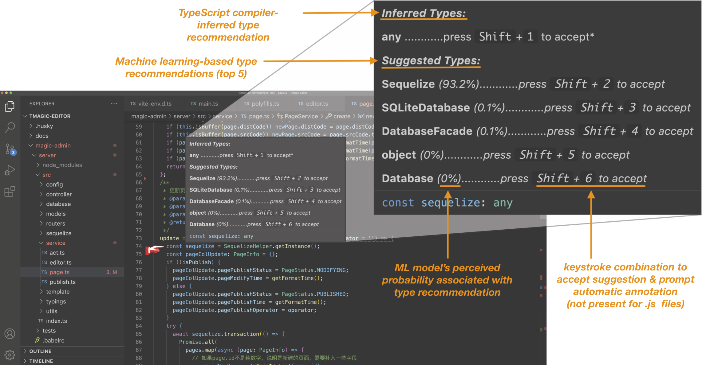

# FlexType VS Code Extension

<!-- to do: add shield w/ marketplace link -->

FlexType provides static and machine-learning based type inference, as well as automatic type annotation for developers to use with TypeScript codebases.

## Features

* Both static and machine-learning based type inference *(powered by the TypeScript compiler's type checker and [ManyTypes4TypeScript](https://huggingface.co/kevinjesse/codebert-MT4TS))*
* Type recommendations and automatic embedding of formal type annotations for type permissive locations *(i.e. variables, parameters, functions, methods)*
* Support for both TypeScript and JavaScript:
    * Type recommendations available for both TypeScript (.ts) and JavaScript (.js) files
    * Automatic type annotation available for TypeScript files
* Easy-to-use extension interface  

## Requirements

Use the following command to install required Python libraries for this extension:

`python -m pip install -r requirements.txt`

## Installation

The extension can be installed from the [Visual Studio Marketplace](https://marketplace.visualstudio.com/items?itemName=ucdavis-decal.flextype).

## Usage
Once the FlexType extension and required dependencies are installed, follow the instructions below to start using the extension.

1. In the VS Code editor, open a TypeScript or JavaScript project and select a specific source file of choice (.ts or .js)
2. Open the Command Palette (using `View > Command Palette` or the appropriate keyboard shortcut)
3. Select the command `FlexType: Suggest Types` to activate the extension
4. Hover over a type permissive location in the source code to see a dialog with recommended types
    > Hover Dialog Anatomy: 


5. Use the corresponding keystrokes from the hover dialog to accept a type suggestion and prompt automatic annotation *(for Typescript files (.ts) only)*

<!-- ## Known Issues

Calling out known issues can help limit users opening duplicate issues against your extension. -->

## Performance Across 150 Top JavaScript Projects (JS -> TS)
```
+------------------------------------------------------------------+
|                Repository                |Stars|TC (%)|TC + NN(%)|
+------------------------------------------+-----+------+----------+
|      goldbergyoni/nodebestpractices      |77728| 33.73|   60.0   |
+------------------------------------------+-----+------+----------+
|            Dogfalo/materialize           |38682| 29.02|   52.6   |
+------------------------------------------+-----+------+----------+
|   yangshun/front-end-interview-handbook  |33963| 19.83|   45.69  |
+------------------------------------------+-----+------+----------+
|               quilljs/quill              |32667| 26.28|   55.01  |
+------------------------------------------+-----+------+----------+
|             marktext/marktext            |31921| 33.1 |   56.63  |
+------------------------------------------+-----+------+----------+
|   MostlyAdequate/mostly-adequate-guide   |21732| 17.69|   30.2   |
+------------------------------------------+-----+------+----------+
|               Kong/insomnia              |20947| 34.81|   55.0   |
+------------------------------------------+-----+------+----------+
|                 pugjs/pug                |20753| 26.46|   53.32  |
+------------------------------------------+-----+------+----------+
|                wekan/wekan               |17988| 28.52|   49.42  |
+------------------------------------------+-----+------+----------+
|           louislam/uptime-kuma           |17288| 31.25|   56.65  |
+------------------------------------------+-----+------+----------+
|               mysqljs/mysql              |17177| 15.6 |   43.24  |
+------------------------------------------+-----+------+----------+
|           alsotang/node-lessons          |16408| 22.73|   52.44  |
+------------------------------------------+-----+------+----------+
|     responsively-org/responsively-app    |16329| 41.9 |   65.56  |
+------------------------------------------+-----+------+----------+
|                 knex/knex                |15803| 23.63|   50.45  |
+------------------------------------------+-----+------+----------+
|             browsh-org/browsh            |14324| 50.0 |   68.73  |
+------------------------------------------+-----+------+----------+
|           bvaughn/react-window           |12468| 40.13|   59.06  |
+------------------------------------------+-----+------+----------+
|             OptimalBits/bull             |12450| 23.41|   48.47  |
+------------------------------------------+-----+------+----------+
|    PavelDoGreat/WebGL-Fluid-Simulation   |12090| 34.68|   56.07  |
+------------------------------------------+-----+------+----------+
|   VerbalExpressions/JSVerbalExpressions  |11982| 34.71|   50.32  |
+------------------------------------------+-----+------+----------+
|              webrtc/samples              |11790| 48.9 |   65.17  |
+------------------------------------------+-----+------+----------+
|         wenzhixin/bootstrap-table        |11250| 28.25|   44.69  |
+------------------------------------------+-----+------+----------+
|         imakewebthings/waypoints         |10322| 19.55|   43.73  |
+------------------------------------------+-----+------+----------+
|    jquery-validation/jquery-validation   |10189| 15.73|   46.57  |
+------------------------------------------+-----+------+----------+
|            zhaoolee/ChineseBQB           |10188| 23.97|   46.11  |
+------------------------------------------+-----+------+----------+
|   meliorence/react-native-snap-carousel  | 9472| 52.04|   74.1   |
+------------------------------------------+-----+------+----------+
|      jhen0409/react-native-debugger      | 9347| 36.2 |   58.22  |
+------------------------------------------+-----+------+----------+
|              exceljs/exceljs             | 9345| 30.35|   45.04  |
+------------------------------------------+-----+------+----------+
|          GoogleChromeLabs/carlo          | 9298| 33.01|   52.69  |
+------------------------------------------+-----+------+----------+
|     timqian/chinese-independent-blogs    | 9263| 30.23|   76.74  |
+------------------------------------------+-----+------+----------+
|         bailicangdu/vue2-happyfri        | 9185| 24.05|   40.04  |
+------------------------------------------+-----+------+----------+
|              aksakalli/gtop              | 9080| 25.26|   33.68  |
+------------------------------------------+-----+------+----------+
|          carhartl/jquery-cookie          | 8653| 38.63|   61.36  |
+------------------------------------------+-----+------+----------+
|              grommet/grommet             | 7899| 38.81|   61.63  |
+------------------------------------------+-----+------+----------+
|               hakimel/Ladda              | 7856| 45.45|   59.09  |
+------------------------------------------+-----+------+----------+
|               vercel/serve               | 7752| 25.58|   58.14  |
+------------------------------------------+-----+------+----------+
|             isaacs/node-glob             | 7512| 23.42|   58.6   |
+------------------------------------------+-----+------+----------+
|            alyssaxuu/screenity           | 7137| 81.23|   95.08  |
+------------------------------------------+-----+------+----------+
|                hpneo/gmaps               | 7114| 27.85|   45.18  |
+------------------------------------------+-----+------+----------+
|              aws/aws-sdk-js              | 7035| 15.95|   37.16  |
+------------------------------------------+-----+------+----------+
|                 ljharb/qs                | 7027| 29.18|   47.79  |
+------------------------------------------+-----+------+----------+
|              octref/polacode             | 6619| 45.82|   65.58  |
+------------------------------------------+-----+------+----------+
|       gregberge/loadable-components      | 6564| 24.26|   46.36  |
+------------------------------------------+-----+------+----------+
|         bda-research/node-crawler        | 6166| 16.27|   34.58  |
+------------------------------------------+-----+------+----------+
|          sdc-alibaba/SUI-Mobile          | 6156| 23.86|   49.43  |
+------------------------------------------+-----+------+----------+
|          ProseMirror/prosemirror         | 5895| 47.6 |   75.96  |
+------------------------------------------+-----+------+----------+
|         davidmerfield/randomColor        | 5821| 51.06|   74.77  |
+------------------------------------------+-----+------+----------+
|              veltman/flubber             | 5797| 29.01|   63.91  |
+------------------------------------------+-----+------+----------+
|              bndw/wifi-card              | 5775| 40.74|   59.26  |
+------------------------------------------+-----+------+----------+
|          LogRocket/redux-logger          | 5660| 29.27|   46.34  |
+------------------------------------------+-----+------+----------+
|             flatiron/director            | 5610| 19.82|   48.78  |
+------------------------------------------+-----+------+----------+
|       HashLips/hashlips_art_engine       | 5561| 48.87|   74.11  |
+------------------------------------------+-----+------+----------+
|      antonioru/beautiful-react-hooks     | 5519| 64.79|   76.78  |
+------------------------------------------+-----+------+----------+
|              ly525/luban-h5              | 5329| 44.24|   59.05  |
+------------------------------------------+-----+------+----------+
|          Jasonette/JASONETTE-iOS         | 5306| 23.72|   48.96  |
+------------------------------------------+-----+------+----------+
|               ai/size-limit              | 5145| 37.03|   58.56  |
+------------------------------------------+-----+------+----------+
|            openpgpjs/openpgpjs           | 5096| 35.05|   52.02  |
+------------------------------------------+-----+------+----------+
|            vuejs/v2.vuejs.org            | 5085| 30.53|   48.62  |
+------------------------------------------+-----+------+----------+
|           andrewngu/sound-redux          | 5043| 35.28|   61.94  |
+------------------------------------------+-----+------+----------+
|        garbles/why-did-you-update        | 5033| 38.89|   62.04  |
+------------------------------------------+-----+------+----------+
|            jscs-dev/node-jscs            | 5012| 21.94|   41.26  |
+------------------------------------------+-----+------+----------+
|     greatsuspender/thegreatsuspender     | 4932| 32.87|   54.05  |
+------------------------------------------+-----+------+----------+
|              WebGoat/WebGoat             | 4924| 18.38|   42.55  |
+------------------------------------------+-----+------+----------+
|                 olado/doT                | 4800| 25.86|   62.32  |
+------------------------------------------+-----+------+----------+
|   GoogleChromeLabs/react-adaptive-hooks  | 4797| 55.32|   61.7   |
+------------------------------------------+-----+------+----------+
|                sofish/pen                | 4747| 21.89|   53.22  |
+------------------------------------------+-----+------+----------+
|           HuddleEng/PhantomCSS           | 4741| 37.43|   73.33  |
+------------------------------------------+-----+------+----------+
|           xiaolin3303/wx-charts          | 4703| 36.51|   61.95  |
+------------------------------------------+-----+------+----------+
|            fkling/astexplorer            | 4660| 35.84|   54.24  |
+------------------------------------------+-----+------+----------+
|           componentjs/component          | 4582| 1.27 |   25.32  |
+------------------------------------------+-----+------+----------+
|            developit/greenlet            | 4555| 32.0 |   56.0   |
+------------------------------------------+-----+------+----------+
|         lihongxun945/jquery-weui         | 4490| 24.35|   55.44  |
+------------------------------------------+-----+------+----------+
|           janhuenermann/neurojs          | 4343| 24.58|   45.62  |
+------------------------------------------+-----+------+----------+
|               jaz303/tipsy               | 2032| 18.6 |   46.51  |
+------------------------------------------+-----+------+----------+
|        cloudflarearchive/backgrid        | 2024| 13.28|   35.71  |
+------------------------------------------+-----+------+----------+
|           montagejs/collections          | 2020| 16.74|   39.07  |
+------------------------------------------+-----+------+----------+
|           survivejs/react-book           | 2018| 22.08|   36.93  |
+------------------------------------------+-----+------+----------+
|        xotahal/react-native-motion       | 2015| 43.32|   53.48  |
+------------------------------------------+-----+------+----------+
|                qTip2/qTip2               | 2007| 19.41|   38.55  |
+------------------------------------------+-----+------+----------+
|         DKirwan/calendar-heatmap         | 1987| 30.61|   62.24  |
+------------------------------------------+-----+------+----------+
|       christinecha/choreographer-js      | 1942| 30.3 |   50.91  |
+------------------------------------------+-----+------+----------+
|              caolan/nodeunit             | 1914| 19.61|   47.98  |
+------------------------------------------+-----+------+----------+
|               gcanti/tcomb               | 1908| 13.37|   33.56  |
+------------------------------------------+-----+------+----------+
|          TargetProcess/tauCharts         | 1905| 52.93|   69.01  |
+------------------------------------------+-----+------+----------+
|              mashery/iodocs              | 1900| 17.79|   40.97  |
+------------------------------------------+-----+------+----------+
|       onmyway133/PushNotifications       | 1894| 32.54|   48.11  |
+------------------------------------------+-----+------+----------+
|                canjs/canjs               | 1891| 21.76|   44.4   |
+------------------------------------------+-----+------+----------+
|                cujojs/curl               | 1890| 17.47|   40.41  |
+------------------------------------------+-----+------+----------+
|                geddy/geddy               | 1876| 19.48|   44.5   |
+------------------------------------------+-----+------+----------+
|          zerosoul/chinese-colors         | 1867| 37.17|   61.95  |
+------------------------------------------+-----+------+----------+
|  moaazsidat/react-native-qrcode-scanner  | 1866| 37.5 |   37.5   |
+------------------------------------------+-----+------+----------+
|        google/closure-compiler-js        | 1860| 29.45|   49.69  |
+------------------------------------------+-----+------+----------+
|             JoelOtter/kajero             | 1856| 46.69|   61.78  |
+------------------------------------------+-----+------+----------+
|               pshihn/workly              | 1855| 32.4 |   51.2   |
+------------------------------------------+-----+------+----------+
|           joshwcomeau/use-sound          | 1833| 41.27|   68.25  |
+------------------------------------------+-----+------+----------+
|            Ramotion/aquarelle            | 1804| 23.33|   56.67  |
+------------------------------------------+-----+------+----------+
|             tobytailor/gordon            | 1803| 31.3 |   59.07  |
+------------------------------------------+-----+------+----------+
|              hnqlv/minigrid              | 1800| 28.97|   57.01  |
+------------------------------------------+-----+------+----------+
|         HenrikJoreteg/hjs-webpack        | 1799| 28.39|   44.52  |
+------------------------------------------+-----+------+----------+
|           andrewrk/groovebasin           | 1795| 35.18|   52.56  |
+------------------------------------------+-----+------+----------+
|          joehewitt/scrollability         | 1788| 46.61|   75.0   |
+------------------------------------------+-----+------+----------+
|m0bilesecurity/RMS-Runtime-Mobile-Security| 1784| 26.16|   45.59  |
+------------------------------------------+-----+------+----------+
|            ScottHamper/Cookies           | 1784| 25.17|   50.34  |
+------------------------------------------+-----+------+----------+
|              ender-js/Ender              | 1783| 20.26|   47.39  |
+------------------------------------------+-----+------+----------+
|              Boscop/web-view             | 1779| 23.5 |   38.94  |
+------------------------------------------+-----+------+----------+
|         tvillarete/apple-music-js        | 1771| 30.68|   67.97  |
+------------------------------------------+-----+------+----------+
|           hjacobs/kube-ops-view          | 1767| 39.28|   55.65  |
+------------------------------------------+-----+------+----------+
|          DemocracyOS/democracyos         | 1753| 20.13|   40.08  |
+------------------------------------------+-----+------+----------+
|         bodyno/react-starter-kit         | 1752| 30.52|   40.81  |
+------------------------------------------+-----+------+----------+
|        chenglou/react-tween-state        | 1748| 22.51|   34.9   |
+------------------------------------------+-----+------+----------+
|                binggg/mrn                | 1739| 25.84|   53.93  |
+------------------------------------------+-----+------+----------+
|              Automattic/knox             | 1738| 16.48|   41.12  |
+------------------------------------------+-----+------+----------+
|             getify/asynquence            | 1735| 16.6 |   45.82  |
+------------------------------------------+-----+------+----------+
|          rstudio/shiny-examples          | 1725| 25.51|   53.99  |
+------------------------------------------+-----+------+----------+
|          debugger22/github-audio         | 1718| 48.03|   66.93  |
+------------------------------------------+-----+------+----------+
|          facebookarchive/fb-flo          | 1703| 20.12|   43.96  |
+------------------------------------------+-----+------+----------+
|    DavidWells/isomorphic-react-example   | 1702| 19.37|   39.19  |
+------------------------------------------+-----+------+----------+
|                nytimes/ice               | 1699| 15.83|   35.64  |
+------------------------------------------+-----+------+----------+
|      chieffancypants/angular-hotkeys     | 1696| 27.93|   49.35  |
+------------------------------------------+-----+------+----------+
|            BinaryMuse/fluxxor            | 1695| 19.71|   32.14  |
+------------------------------------------+-----+------+----------+
|               jaredly/treed              | 1694| 30.55|   57.61  |
+------------------------------------------+-----+------+----------+
|       nnupoor-zz/js_designpatterns       | 1690| 33.11|   52.32  |
+------------------------------------------+-----+------+----------+
|              trailsjs/trails             | 1684| 21.64|   37.13  |
+------------------------------------------+-----+------+----------+
|           mbenford/ngTagsInput           | 1658| 21.63|   43.9   |
+------------------------------------------+-----+------+----------+
|         nytimes/backbone.stickit         | 1657| 18.12|   50.55  |
+------------------------------------------+-----+------+----------+
|     fnakstad/angular-client-side-auth    | 1653| 13.65|   27.89  |
+------------------------------------------+-----+------+----------+
|              addyosmani/tmi              | 1644| 26.92|   50.0   |
+------------------------------------------+-----+------+----------+
|            SSENSE/vue-carousel           | 1643| 26.93|   43.61  |
+------------------------------------------+-----+------+----------+
|           DavidWells/analytics           | 1625| 39.88|   62.56  |
+------------------------------------------+-----+------+----------+
|           RadLikeWhoa/Countable          | 1623| 33.69|   52.17  |
+------------------------------------------+-----+------+----------+
|             tildeio/htmlbars             | 1621| 24.97|   41.66  |
+------------------------------------------+-----+------+----------+
|             28mm/blast-radius            | 1620| 31.48|   59.7   |
+------------------------------------------+-----+------+----------+
|          fengyuanchen/distpicker         | 1614| 34.5 |   53.61  |
+------------------------------------------+-----+------+----------+
|             bevacqua/woofmark            | 1610| 27.44|   53.41  |
+------------------------------------------+-----+------+----------+
|  FaridSafi/react-native-gifted-listview  | 1606| 45.55|   51.11  |
+------------------------------------------+-----+------+----------+
|    jquery-boilerplate/jquery-patterns    | 1604| 22.86|   22.86  |
+------------------------------------------+-----+------+----------+
|               1602/compound              | 1601| 18.86|   52.09  |
+------------------------------------------+-----+------+----------+
|           ericdrowell/ElGrapho           | 1578| 20.03|   51.82  |
+------------------------------------------+-----+------+----------+
|          vmware-archive/scripted         | 1577| 20.48|   46.01  |
+------------------------------------------+-----+------+----------+
|                tjmehta/101               | 1564| 17.08|   35.28  |
+------------------------------------------+-----+------+----------+
|            LiranCohen/stickUp            | 1564| 23.24|   42.39  |
+------------------------------------------+-----+------+----------+
|       Akryum/vue-observe-visibility      | 1544| 35.19|   35.19  |
+------------------------------------------+-----+------+----------+
|              kadirahq/lokka              | 1543| 46.56|   65.83  |
+------------------------------------------+-----+------+----------+
|            dlmanning/gulp-sass           | 1543| 13.5 |   33.5   |
+------------------------------------------+-----+------+----------+
|             andris9/jStorage             | 1539| 39.68|   69.23  |
+------------------------------------------+-----+------+----------+
|                  mtjs/mt                 | 1538| 22.04|   46.21  |
+------------------------------------------+-----+------+----------+
|            toddmotto/fireshell           | 1534| 19.31|   49.79  |
+------------------------------------------+-----+------+----------+
|         btford/angular-socket-io         | 1531| 17.35|   32.65  |
+------------------------------------------+-----+------+----------+
|           meteoric/meteor-ionic          | 1530| 21.2 |   47.74  |
+------------------------------------------------------------------+
```

## Release Notes

### 1.0.0

Initial release of FlexType.
